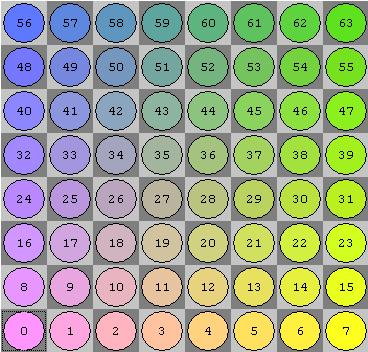

# Board Representation
## The Board of Sets
### Square Mapping Considerations
#### Deduction on Files and Ranks
We use LSF-mapping (Least Significant File, i.e. iterating through ranks at the outer level, then files at the inner level).
```
square_idx = 8 * rank + file;
file = square_idx % 8 = square_idx & 7;
rank = square_idx / 8 = square_idx >> 3;
```

#### Endianness
We use little endian mapping to retain the nice relations (a < h and 0 < 7).

#### Little-Endian Rank-File Mapping


##### Enumeration
```rust
pub enum Square {
  a1, b1, c1, d1, e1, f1, g1, h1,
  a2, b2, c2, d2, e2, f2, g2, h2,
  a3, b3, c3, d3, e3, f3, g3, h3,
  a4, b4, c4, d4, e4, f4, g4, h4,
  a5, b5, c5, d5, e5, f5, g5, h5,
  a6, b6, c6, d6, e6, f6, g6, h6,
  a7, b7, c7, d7, e7, f7, g7, h7,
  a8, b8, c8, d8, e8, f8, g8, h8
}
```

##### Compass Rose
```
  noWe         nort         noEa
          +7    +8    +9
              \  |  /
  west    -1 <-  0 -> +1    east
              /  |  \
          -9    -8    -7
  soWe         sout         soEa
```

### Standard Board Definition
We use a denser board definition. There are two bitboards for white and black pieces, and 6 bitboards for each piece type. To get white pawns for example, we would intersect the white bitboard with the pawns bitboard.
```rust
enum Piece {
    Pawn = 2,
    Rook,
    Knight,
    Bishop,
    Queen,
    King,
}

enum Color {
    White,
    Black,
}

pub struct Board {
    boards: [Bitboard; 8],
}

impl Board {
    fn get_piece(&self, p: Piece) -> Bitboard {
        self.boards[p as usize]
    }

    fn get_color(&self, c: Color) -> Bitboard {
        self.boards[c as usize]
    }

    fn get_piece_of_color(&self, p: Piece, c: Color) -> Bitboard {
        self.get_piece(p) & self.get_color(c)
    }
}
```
